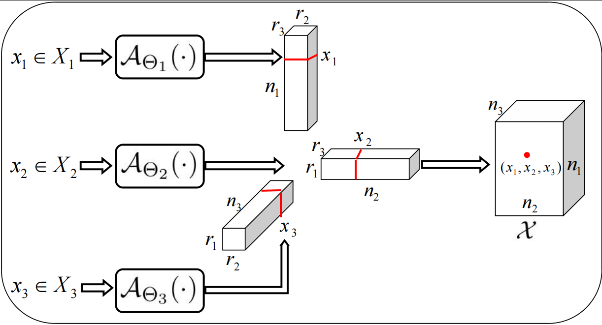
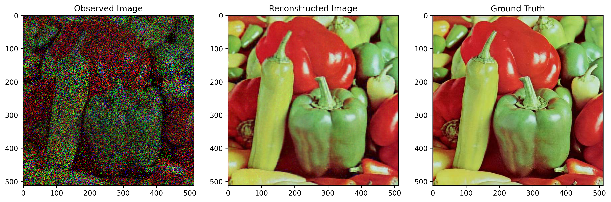
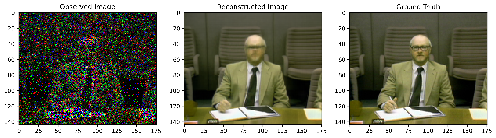
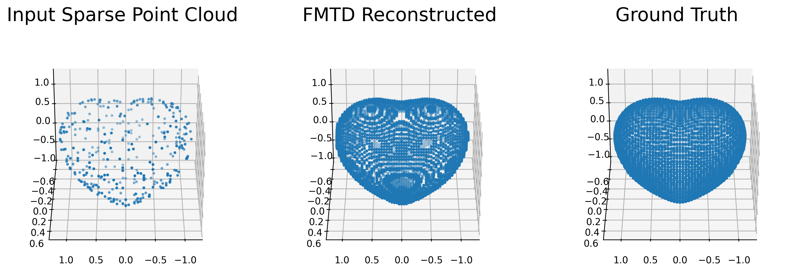

# 🚀 FMTD: Functional Multiple Tensor Decomposition

The implementation of **Functional Multiple Tensor Decomposition (FMTD)**. This project introduces a novel tensor decomposition method (multiple tensor decomposition) for high-order tensor analysis by leveraging Implicit Neural Representation (INR). The multiple tensor decomposition is a generalization of the Triple decomposition to arbitrary orders, allowing the factor tensors to have different short-edge lengths. 

**Key Contributions:**
1.  **FMTD Framework:** Decomposes high-order tensors via Implicit Neural Representation (INR), decoupling dimensions to capture intrinsic features.
2.  **Robust Tensor Completion (RTC):** Implements the **Proximal Alternating Least Squares (PALS)** algorithm within the FMTD framework to handle missing data and noise.
3.  **Point Cloud Upsampling (PCU):** Extends FMTD to 3D geometry processing for reconstructing dense geometric structures from sparse input.

**The framewrok of FMTD**


## 🛠️ Installation

We recommend using a virtual environment (e.g., conda) to manage dependencies.

### Prerequisites
- Python >= 3.8
- PyTorch: >= 2.4.1 (Tested on 2.4.1+cu121)
- CUDA: >= 12.1 (Runtime)

### Setup
1.  **Clone the repository:**
    ```bash
    git clone https://github.com/KunjingYang/FMTD-main.git
    cd FMTD-main
    ```

2.  **Install dependencies:**
    Ensure you have PyTorch installed (preferably with CUDA support), then install the remaining requirements:
    ```bash
    pip install -r requirements.txt
    ```

### For CPU-only Users (No GPU required):
If you do not have an NVIDIA GPU, you can install the CPU version of PyTorch directly:
```bash
pip install torch torchvision --index-url https://download.pytorch.org/whl/cpu
```
The code will automatically detect your device and run on the CPU if no GPU is available.

## 📂 Project Structure

The project directory is organized as follows:

```text
FMTD-main
├── data/                   # Directory to store input datasets (images, videos, point clouds)
├── images/                 # Directory for saving visualization results
├── output/                 # Directory where restoration results will be saved
├── FMTD_simulated_data.py  # [Simulation] Generates synthetic tensors to verify algorithm convergence 
│                           # and obtains factor tensors for multiple tensor decompositions.
├── FMTD_RTC_image.py       # [Image] Performs Robust Tensor Completion (RTC) for 3D color image data.
│                           # It handles tasks like image inpainting and denoising.
├── FMTD_RTC_video.py       # [Video] Applies FMTD for video completion, treating video as a 4th-order 
│                           # tensor for restoration and denoising tasks.
│── FMTD_PointCloud.py      # [3D] Implements point cloud upsampling, reconstructing dense geometric 
│                           # structures from sparse inputs using the FMTD framework.
├── model.py                # Core model definitions
├── utils.py                # Utility functions
├── requirements.txt        # Project dependencies
└── README.md               # Project documentation
```

## 💾 Data Preparation

Please organize your datasets in the `data/` directory.

## 🏃 Running the Experiments

To run a specific task, simply execute the corresponding script from the root directory.

**1. Image Inpainting / Denoising (RTC-Image)**
```bash
python FMTD_RTC_image.py
```
**2. Video Completion (RTC-Video)**
```bash
python FMTD_RTC_video.py
```
**3. Point Cloud Upsampling (PCU)**
```bash
python FMTD_PointCloud.py
```
**4. Simulation / Otain the factor tensors**
```bash
python FMTD_simulated_data.py
```


## 📝 Usage Examples
Taking `FMTD_RTC_image' as an example, here is a detailed introduction to the parameters that users can adjust.

| Argument | Type | Default | Description |
| :--- | :--- | :--- | :--- |
| `--data_path` | string | `data/pepper.jpg` | Path to the input image. |
| `--sr` | float | `0.4` | Sampling rate, ranging from 0 to 1 (e.g., 0.4 means 40%). |
| `--noise_level` | float | `0.2` | Noise level, used to simulate salt-and-pepper noisy environments. |
| `--ranks` | int list | `[12, 12, 16]` | Multiple ranks, requires three integers corresponding to  $ r_1, r_2, r_3 $ . |
| `--is_imshow` | int | `1` | Whether to display the image. `1` to show, `0` to hide. |
| `--is_save_mat` | int | `0` | Whether to save the result as a `.mat` file. `1` to save, `0` not to save. |

Here are some specific examples for running the code:

**1. Run with default parameters:**
Use the built-in default settings (processing pepper.jpg with a sampling rate of 0.4 and noise level of 0.2):
```bash
python FMTD_RTC_image.py
```
**2. Custom image and sampling rate:**
Specify flower.jpg for processing and increase the sampling rate to 0.6:
```bash
python FMTD_RTC_image.py --data_path data/flower.jpg --sr 0.6
```
**3. Adjust ranks and noise level:**
Set custom multiple ranks [10, 10, 14] and add a noise level of 0.1:
```bash
python FMTD_RTC_image.py --ranks 10 10 14 --noise_level 0.1
```
**4. Save results without displaying:**
If you are running the code on a server (without a display), you can turn off image visualization:
```bash
python FMTD_RTC_image.py --is_imshow 0 --is_save_mat 1
```

Different tasks may correspond to different parameters. Users can utilize the parameters provided in the code according to their specific needs.

## 📊 Expected Results
Upon completion, the output files (restored images, upsampled point clouds, and log files) will be saved in the output/ directory.
You can also monitor the algorithm's reconstruction process in real-time within the output/ directory.





## 📝 Citation
If you use this code for your research, please cite:

```bibtex
@misc{yang2026fmt,
  title={Functional Multiple Tensor Decomposition},
  author={Yang, Kunjing, Libin Zheng and Minru Bai},
  year={},
  eprint={2601.xxxxx},
  archivePrefix={arXiv},
  primaryClass={cs.CV}
}
```